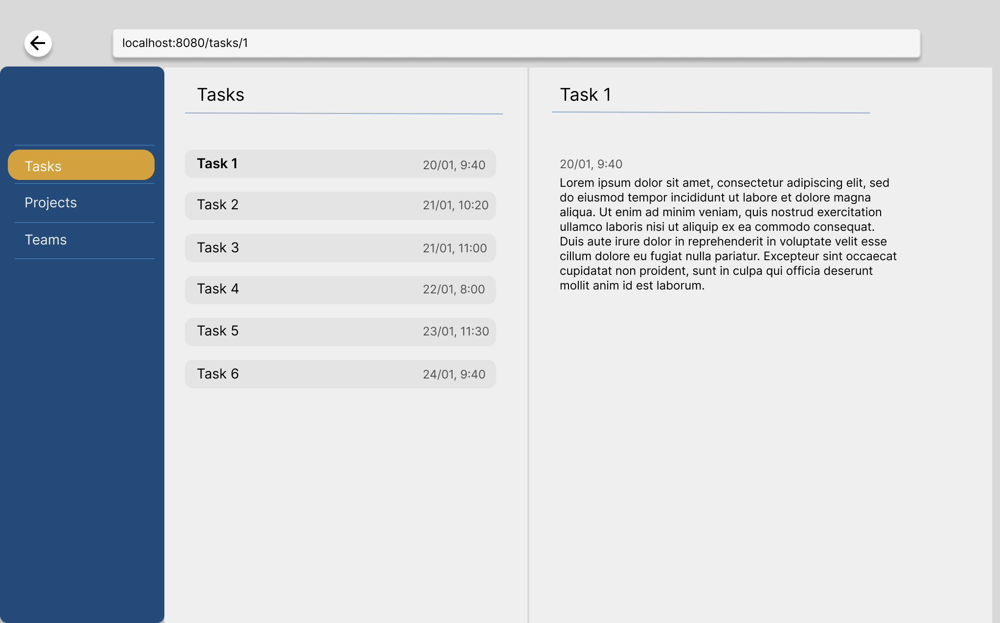

## Programming Assignment

In this programming assignment, you’ll create a simple web application in Flutter. The application will be used to display a Master-Detail view for a list of tasks obtained from the mocked API. The example design is presented in the image below.

### Implementation requirements:
1. Use the following packages:
- freezed (generating class methods)
- riverpod (state management)
- go_router (navigation)
2. A *Task* class should have three properties (*Title*, *Description* and *Date*) - currently it has only *Title* and *Date*. Add *Description* property to the *Task* class.
3. Implement a navigation (using go_router package) that supports changing urls and back button in the browser.
4. Add a side menu or navigation bar with 3 pages (*Tasks*, *Projects* and *Teams*).
- First page contains a list of tasks. When one of the items is pressed, a detailed view is displayed. Every list item should show *Title* and *Date*. The detailed view should also present *Description* text.
- _Projects_ and _Teams_ pages should display only texts with page names.
5. Use _getTasks_ method from _network_service.dart_ file to get data for the _Tasks_ page.
6. Use the Riverpod package to display the list of tasks.
7. Make the application suitable for internationalization.

**Optional**: Add support for changing language (dropdown with English and Arabic languages).

**Optional**: Make the application responsive.

